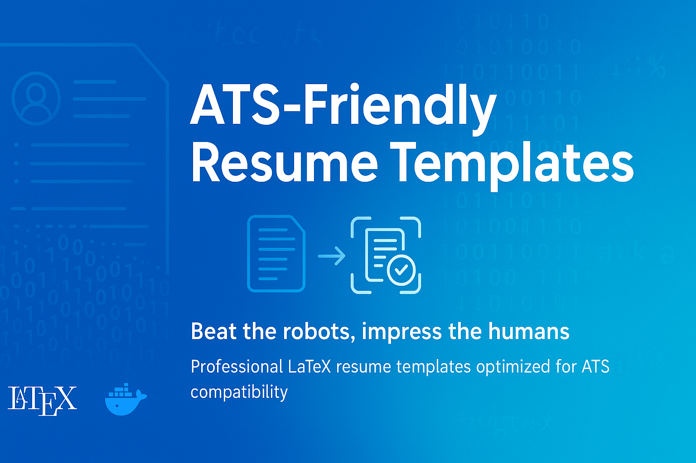
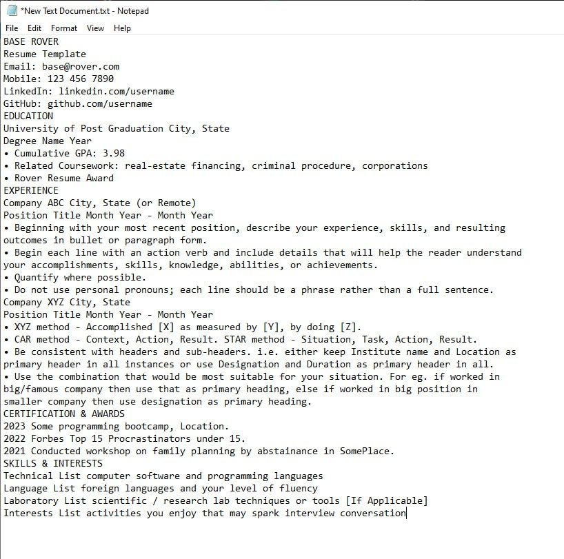
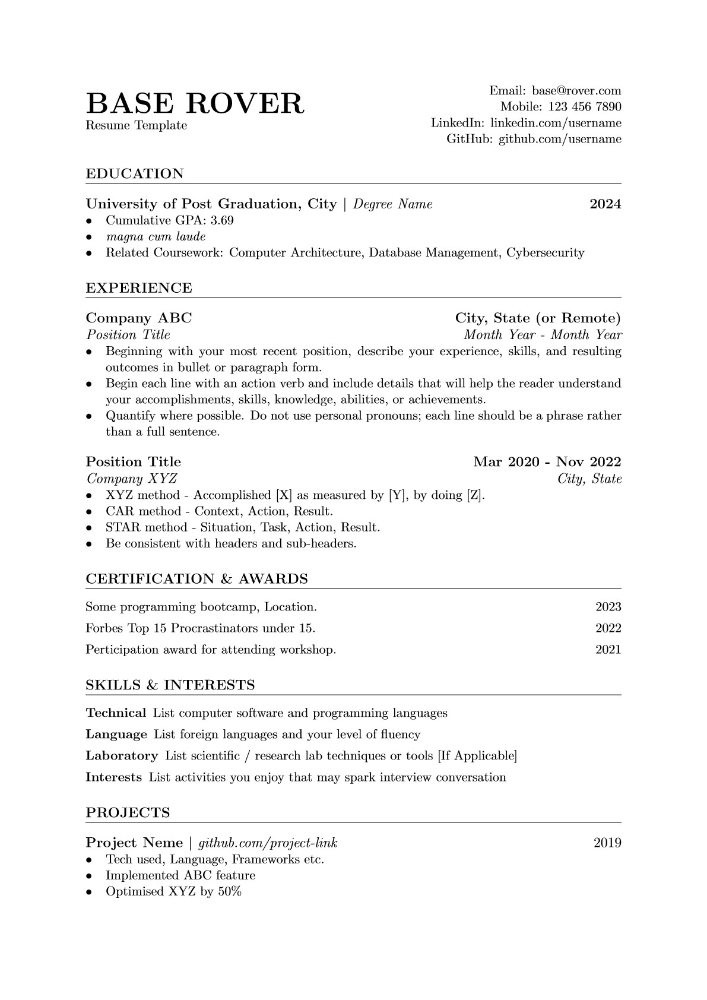
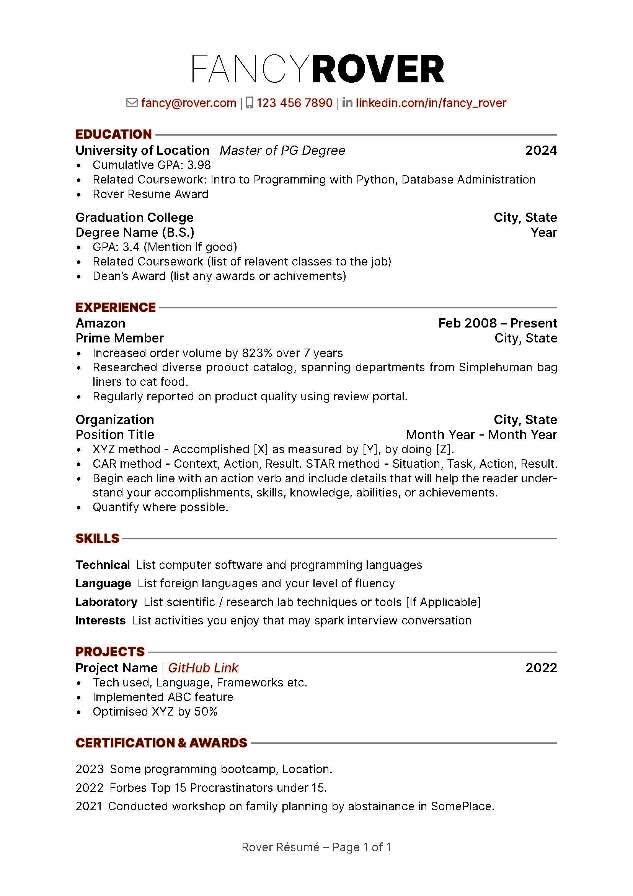

## 🧰 How to Use This Template    
Click the green **"Use this template"** button at the top of the page, then choose **"Create a new repository"**.   
This will create your own copy of this project, which you can modify freely — no need to fork!   

---

<div align="center">
    
</div>

<h1 align="center">ATS-Friendly Resume Formatting Best Practices</h1>


This repository is based on a LaTeX Docker container which is very easy to use even for people without Docker knowledge. The only thing you need is to install Docker Desktop, which is super easy and straightforward. This approach eliminates all the headaches of setting up a LaTeX environment locally while providing a full-featured system that works perfectly across all operating systems. A major advantage over Overleaf is that you can use GitHub Copilot in VS Code or Cursor here, which significantly enhances productivity when working with LaTeX.

This repository provides comprehensive resources and practical guidance for creating professional resumes targeted specifically at tech industry positions.

## Quick Start

Getting started with this LaTeX resume environment is simple:

1. **Prerequisites**  
   Install:  
   - [Docker Desktop](https://www.docker.com/products/docker-desktop/)  
   - Cursor **or** VS Code with the **Dev Containers** extension

2. **Clone Repository**
   ```bash
   git clone <repository-url>
   cd Resume_CV_ATS-Friendly
   ````

3. **Open in Editor**

   * Cursor: `cursor .`
   * VS Code: `code .`
   * Or open the folder from the GUI

4. **Start Container (Two Methods)**

   ### Method 1 — Dev Containers (Recommended)

   When you open the folder, **VS Code will show a popup in the bottom-left corner**:

   👉 **REOPEN IN CONTAINER**

   **Just click it. That’s all you need. Enjoy.**
   VS Code will automatically build the full LaTeX environment for you.

   If the popup doesn’t appear:
   `Ctrl+Shift+P` → **Dev Containers: Rebuild and Reopen in Container**

   **Shutdown:** Close the editor window — the container stops automatically.

   ### Method 2 — Docker Compose

   ```bash
   docker-compose up -d --build
   ```

   **Shutdown:** Close the editor window — it will stop the container automatically.

5. **Edit LaTeX Files**

   * Go to the `personal-resume` directory and create a separate folder for each resume.
     (Each `.tex` file generates extra build files — this keeps everything clean and organized.)
   * Copy a `.tex` template from `ATS-Friendly-Templates` into your new resume folder.
   * Click the **Compile (▶️)** button once. After that, it auto-builds on save.
   * Open the generated `.pdf` to see instant updates — much faster and smoother than Overleaf.
   * All changes are saved directly to your local workspace.
   * Use Copilot and other extensions to refine your writing.
   * **Important:** Enable **File → Auto Save** once. This protects you from losing any progress across all repos.

6. **Install LaTeX Workshop Extension (Recommended)**

   For the best LaTeX editing experience, install the **LaTeX Workshop** extension:
   * **Name:** LaTeX Workshop
   * **ID:** James-Yu.latex-workshop
   * **Marketplace:** Available on the VS Code Marketplace

   **Key Features:**
   * Live PDF preview with forward & inverse sync
   * Auto-build on save
   * Syntax highlighting + rich snippet library
   * IntelliSense for citations, labels, references
   * Works seamlessly with Windows, WSL, and Dev Containers

7. **Fix Git Issues (If Needed)**

   If you encounter Git errors like "dubious ownership" or "cannot run ssh" when using `git pull` or `git push`, run the fix script:
   ```bash
   ./fix-git-ownership.sh
   ```
   This script automatically detects your current directory and Git remote URL, then fixes Git permission and SSH connection issues in the Docker container. You only need to run it once per project.

---

***Table of Contents***

<details>
  <summary><a href="#1-about-this-repository"><i><b>1. About this Repository</b></i></a></summary>
  <div>
    &nbsp;&nbsp;&nbsp;&nbsp;&nbsp;&nbsp;&nbsp;&nbsp;&nbsp;&nbsp;<a href="#11-who-is-this-tutorial-for">1.1. Who Is This Tutorial For?</a><br>
    &nbsp;&nbsp;&nbsp;&nbsp;&nbsp;&nbsp;&nbsp;&nbsp;&nbsp;&nbsp;<a href="#12-what-will-you-learn">1.2. What Will You Learn?</a><br>
    &nbsp;&nbsp;&nbsp;&nbsp;&nbsp;&nbsp;&nbsp;&nbsp;&nbsp;&nbsp;<a href="#13-prerequisites">1.3. Prerequisites</a><br>
    &nbsp;&nbsp;&nbsp;&nbsp;&nbsp;&nbsp;&nbsp;&nbsp;&nbsp;&nbsp;<a href="#14-repository-structure">1.4. Repository Structure</a><br>
  </div>
</details>
&nbsp;

<details>
  <summary><a href="#2-latex-environment-options"><i><b>2. LaTeX Environment Options</b></i></a></summary>
  <div>
    &nbsp;&nbsp;&nbsp;&nbsp;&nbsp;&nbsp;&nbsp;&nbsp;&nbsp;&nbsp;<a href="#21-latex-environment-choices">2.1. LaTeX Environment Choices</a><br>
    &nbsp;&nbsp;&nbsp;&nbsp;&nbsp;&nbsp;&nbsp;&nbsp;&nbsp;&nbsp;<a href="#22-recommended-docker-image">2.2. Recommended Docker Image</a><br>
    &nbsp;&nbsp;&nbsp;&nbsp;&nbsp;&nbsp;&nbsp;&nbsp;&nbsp;&nbsp;<a href="#23-best-latex-extension-for-vs-code">2.3. Best LaTeX Extension for VS Code</a><br>
    &nbsp;&nbsp;&nbsp;&nbsp;&nbsp;&nbsp;&nbsp;&nbsp;&nbsp;&nbsp;<a href="#24-alternative-latex-environments">2.4. Alternative LaTeX Environments</a><br>
  </div>
</details>
&nbsp;

<details>
  <summary><a href="#3-applicant-tracking-systems-ats"><i><b>3. Applicant Tracking Systems (ATS)</b></i></a></summary>
  <div>
    &nbsp;&nbsp;&nbsp;&nbsp;&nbsp;&nbsp;&nbsp;&nbsp;&nbsp;&nbsp;<a href="#31-what-is-an-ats">3.1. What is an ATS?</a><br>
    &nbsp;&nbsp;&nbsp;&nbsp;&nbsp;&nbsp;&nbsp;&nbsp;&nbsp;&nbsp;<a href="#32-how-ats-systems-process-resumes">3.2. How ATS Systems Process Resumes</a><br>
    &nbsp;&nbsp;&nbsp;&nbsp;&nbsp;&nbsp;&nbsp;&nbsp;&nbsp;&nbsp;<a href="#33-key-strategies-for-ats-optimization">3.3. Key Strategies for ATS Optimization</a><br>
    &nbsp;&nbsp;&nbsp;&nbsp;&nbsp;&nbsp;&nbsp;&nbsp;&nbsp;&nbsp;<a href="#34-formatting-rules-for-ats-compatibility">3.4. Formatting Rules for ATS Compatibility</a><br>
    &nbsp;&nbsp;&nbsp;&nbsp;&nbsp;&nbsp;&nbsp;&nbsp;&nbsp;&nbsp;<a href="#35-common-mistakes-that-trigger-rejection">3.5. Common Mistakes That Trigger Rejection</a><br>
    &nbsp;&nbsp;&nbsp;&nbsp;&nbsp;&nbsp;&nbsp;&nbsp;&nbsp;&nbsp;<a href="#36-section--field-best-practices">3.6. Section & Field Best Practices</a><br>
    &nbsp;&nbsp;&nbsp;&nbsp;&nbsp;&nbsp;&nbsp;&nbsp;&nbsp;&nbsp;<a href="#37-testing--optimization-tools">3.7. Testing & Optimization Tools</a><br>
    &nbsp;&nbsp;&nbsp;&nbsp;&nbsp;&nbsp;&nbsp;&nbsp;&nbsp;&nbsp;<a href="#38-advanced-optimization-tips">3.8. Advanced Optimization Tips</a><br>
    &nbsp;&nbsp;&nbsp;&nbsp;&nbsp;&nbsp;&nbsp;&nbsp;&nbsp;&nbsp;<a href="#39-quick-self-check-before-submitting">3.9. Quick Self-Check Before Submitting</a><br>
  </div>
</details>
&nbsp;

<div>
  &nbsp;&nbsp;&nbsp;&nbsp;<a href="#4-best-examples"><i><b>4. Best Examples</b></i></a>
</div>
&nbsp;

<details>
  <summary><a href="#5-resume-typography-and-layout-guide"><i><b>5. Resume Typography and Layout Guide</b></i></a></summary>
  <div>
    &nbsp;&nbsp;&nbsp;&nbsp;&nbsp;&nbsp;&nbsp;&nbsp;&nbsp;&nbsp;<a href="#51-font-compatibility-with-pdflatex">5.1. Font Compatibility with pdfLaTeX</a><br>
    &nbsp;&nbsp;&nbsp;&nbsp;&nbsp;&nbsp;&nbsp;&nbsp;&nbsp;&nbsp;<a href="#52-fonts-to-avoid-and-why">5.2. Fonts to Avoid (and Why)</a><br>
    &nbsp;&nbsp;&nbsp;&nbsp;&nbsp;&nbsp;&nbsp;&nbsp;&nbsp;&nbsp;<a href="#53-pdflatex-compatible-fonts-ats-friendly">5.3. pdfLaTeX-Compatible Fonts (ATS-Friendly)</a><br>
    &nbsp;&nbsp;&nbsp;&nbsp;&nbsp;&nbsp;&nbsp;&nbsp;&nbsp;&nbsp;<a href="#54-typography-best-practices-for-ats-compatibility">5.4. Typography Best Practices for ATS Compatibility</a><br>
    &nbsp;&nbsp;&nbsp;&nbsp;&nbsp;&nbsp;&nbsp;&nbsp;&nbsp;&nbsp;<a href="#55-definitive-resume-typography--layout-rules-2025">5.5. Definitive Resume Typography & Layout Rules (2025)</a><br>
  </div>
</details>
&nbsp;

<div>
  &nbsp;&nbsp;&nbsp;&nbsp;<a href="#6-contact-information"><i><b>6. Contact Information</b></i></a>
</div>
&nbsp;

# 1. About This Repository

This repository serves as a comprehensive guide for creating professional, ATS-friendly resumes using LaTeX. It includes templates, best practices, and detailed instructions that help job seekers in the tech industry create resumes that pass through Applicant Tracking Systems while maintaining a professional appearance. The resources here are designed to be practical, actionable, and based on current industry standards.

## 1.1. Who Is This Tutorial For?

This tutorial is designed for several groups of users:

- **Job seekers in tech fields**: Software engineers, data scientists, UX/UI designers, product managers, and other technical professionals looking to optimize their resumes
- **Recent graduates or career changers**: Those entering the tech industry who need guidance on creating industry-specific resumes
- **Career coaches and mentors**: Professionals who help others with job search materials
- **LaTeX beginners and experts**: Whether you're new to LaTeX or experienced, you'll find value in adapting professional templates for tech resumes

## 1.2. What Will You Learn?

By following this repository's guidance, you will learn:

- How to set up and use LaTeX for resume creation with VS Code across different operating systems
- Understanding of Applicant Tracking Systems (ATS) and how to optimize your resume for them
- Strategic selection of fonts, layouts, and formatting to appeal to tech employers
- Best practices for structuring content to highlight technical skills and accomplishments
- How to create a resume that balances machine readability with human appeal
- Techniques for customizing resumes for specific job postings without starting from scratch each time
- Version control strategies for maintaining multiple resume versions

## 1.3. Prerequisites

### 1.3.1. For those familiar with LaTeX and resume writing

- You can jump directly to the ATS optimization sections
- Browse the templates directory for inspiration
- Consider contributing your own templates or improvements

### 1.3.2. For those who know basic document formatting but are new to LaTeX

- Follow the LaTeX installation guide for your operating system
- Start with the beginner-friendly templates
- Take time to understand the template structure before making extensive modifications

### 1.3.3. For complete beginners

- Begin with the "Introduction to LaTeX" tutorial
- Follow the step-by-step guides for installation and setup
- Use the provided templates with minimal modifications initially
- Consider reading the recommended resources on resume content before diving into formatting

## 1.4. Repository Structure

```
Folder PATH listing
+---.devcontainer                    <-- Dev container config
│       devcontainer.json            <-- VS Code dev container settings
│       docker-compose.yml           <-- Docker compose configuration
│       README.md                    <-- Dev container documentation
│
+---ATS-Friendly-Templates           <-- ATS-friendly resume templates
│       base-rover.pdf               <-- Base rover resume PDF
│       base-rover.tex               <-- Base rover resume LaTeX source
│       fancy-rover.pdf              <-- Fancy rover resume PDF
│       fancy-rover.tex              <-- Fancy rover resume LaTeX source
│       README.md                    <-- Templates documentation
│
+---images                           <-- Image resources
│       banner.png                   <-- Banner image
│       base-rover.jpg               <-- Base rover template preview
│       base-rover-on-notepad.jpg    <-- ATS compatibility example
│       fancy-rover.jpg              <-- Fancy rover template preview
│       fancy-rover-on-notepad.jpg   <-- Non-ATS compatible example
│       README.md                    <-- Images documentation
│
+---personal-resumes                 <-- Personal resume examples
│   +---Mostafa_base-rover           <-- Mostafa's base rover resume
│   +---Mostafa_fancy-rover          <-- Mostafa's fancy rover resume
│        README.md                   <-- Personal resumes overview
│
│   .gitignore                       <-- Git exclusions
│   docker-compose.yml               <-- Root Docker compose file (for quick dcu/dcd)
│   LICENSE                          <-- License information
│   README.md                        <-- Project overview
```

# 2. LaTeX Environment Options

Choosing the right LaTeX environment is crucial for creating professional resumes efficiently. This section outlines the recommended options for working with LaTeX, with a focus on reliability, ease of use, and compatibility with modern development tools. We'll explore both containerized solutions and web-based platforms to help you select the approach that best fits your workflow.

## 2.1. LaTeX Environment Choices

Based on our experience, we recommend two primary approaches for working with LaTeX for your resume projects. Local installations of LaTeX on Windows and WSL can be problematic and time-consuming, so we recommend these more reliable options:

### 2.1.1. Docker-Based LaTeX Environment

**Best For:**   
- Users who need AI assistance with Cursor Copilot, need offline capabilities, or prefer working in their own development environment.

| Feature | Description |
|---------|-------------|
| **Full Capabilities** | Docker-based LaTeX provides **complete functionality** equivalent to traditional installations |
| **Environment Control** | Offers **full control** over package installation and configuration |
| **Consistency** | Ensures **identical behavior** across different machines and operating systems |
| **Integration** | Works seamlessly with **local development tools** like Cursor Copilot |
| **Collaboration** | Can be paired with **GitHub workflows** for version control and team collaboration |
| **Isolation** | Keeps LaTeX environment **separate from host system**, preventing conflicts |
| **Portability** | Easy to replicate environment on different machines without lengthy setup |

### 2.1.2. Overleaf Platform

**Best For:**     
- Users who prioritize ease of use, frequent collaboration, or need to access documents from multiple devices without setup.

| Feature | Description |
|---------|-------------|
| **Accessibility** | **Web-based interface** accessible from any device with internet connection |
| **Zero Setup** | Eliminates need for local installation or configuration |
| **Built-in Collaboration** | Supports **real-time editing** with multiple users simultaneously |
| **User-Friendly** | Designed with **intuitive interface** for both beginners and advanced users |
| **Templates** | Provides extensive library of pre-designed templates |
| **Limited Offline Use** | Requires internet connection for most functionality |


## 2.2. Recommended Docker Image

Our repository uses the `texlive/texlive` Docker image (`texlive/texlive:latest`), specifically configured for Cursor Copilot integration. This image was chosen for several important reasons:

### 2.2.1. Why We Chose This Image

| Feature | Description |
|---------|-------------|
| **Complete TeXLive Distribution** | Includes the full TeX Live 2025 distribution with most LaTeX packages |
| **Debian-Based** | Built on Debian for better compatibility with Cursor AI |
| **Optimized for Dev Containers** | Works well with VS Code/Cursor dev container workflows |
| **Pre-configured LaTeX Workshop** | Works seamlessly with the LaTeX Workshop extension |
| **Regular Maintenance** | Actively maintained with updates |
| **Avoid Alpine Issues** | Prevents common Alpine Linux compatibility problems with LaTeX |

### 2.2.2. Technical Details

Our container setup includes:

| Extension | Purpose | Benefits |
|-----------|---------|----------|
| **LaTeX Workshop** | Compilation and preview | Automatic builds, PDF preview, syntax highlighting |
| **LaTeX Utilities** | Enhanced LaTeX editing | Smart environments, math preview, better snippets |
| **LTeX** | Grammar checking | Language-aware proofreading for LaTeX documents |
| **Code Spell Checker** | Spell checking | Identifies typos in code and text |
| **Copilot** | AI assistance | Code completion and suggestions for LaTeX |

The container is configured to:
- Automatically build LaTeX documents on save
- Clean auxiliary files after successful builds
- Use SyncTeX for synchronized PDF viewing
- Update all TeX packages on container startup

You can see the full configuration in the `.devcontainer/devcontainer.json` file.

### 2.2.3. Image Size and Performance Considerations

The Docker image (`texlive/texlive:latest`) is large due to the comprehensive nature of the full TeX Live distribution:

- **Actual installed size:** 4.4 GB for the TeX Live installation in our current container
- **Total container size:** Around 4-5 GB download, using approximately 5-7 GB on disk

You can check the size of your TeX Live installation inside the container with:
```bash
# Check TeX Live installation size
du -sh /usr/local/texlive

# Check overall disk usage
df -h
```

Example output showing the TeX Live installation size:
```
4.4G    /usr/local/texlive
```

You can check Docker image sizes on your host system (not inside the container) with:
```bash
# List all Docker images with sizes
docker images

# Or check a specific image (returns empty if not downloaded yet)
docker images texlive/texlive:latest
```

If a specific image search returns no results, it means that image hasn't been downloaded to your system yet. The image is only downloaded when you first use it.

Example output showing the TeX Live image:
```
IMAGE ID       REPOSITORY            TAG       SIZE      CREATED
8a56b68b4458   texlive/texlive       latest    4.51GB    2 weeks ago
```

This is normal for a complete LaTeX environment that includes thousands of packages, fonts, and documentation. Some key points to understand:

- The image is only downloaded once and cached locally by Docker
- Subsequent project openings reuse the cached image without re-downloading
- The container is created when you open the project and removed when you close your editor
- Docker only downloads updates when the base image changes

If you're concerned about disk space, smaller alternatives like `ghcr.io/qdm12/latexdevcontainer:latest-basic` (around 2-3 GB) are available, but they include fewer LaTeX packages and may not support all advanced resume templates.

## 2.3. Best LaTeX Extension for VS Code

Use the **[LaTeX Workshop](https://marketplace.visualstudio.com/items?itemName=James-Yu.latex-workshop)** extension:

### 2.3.1. Extension Info:

- **Name:** LaTeX Workshop
- **ID:** `James-Yu.latex-workshop`
- **Marketplace:** [View on VS Code Marketplace](https://marketplace.visualstudio.com/items?itemName=James-Yu.latex-workshop)

### 2.3.2. Features:

- Live PDF preview with sync (forward/inverse search)
- Auto build on save
- Syntax highlighting and snippet support
- IntelliSense for citations, labels, and refs
- Works with both Windows and WSL backends

## 2.4. Alternative LaTeX Environments

While this repository uses and recommends the TeX Live 2025 environment described above, some users may prefer alternative LaTeX environments:

### 2.4.1. Web-Based Options

- **Overleaf**: A popular online LaTeX editor with real-time collaboration
- **ShareLaTeX Docker Container**: For those who want a local web-based interface:
  ```bash
  # Basic command to run ShareLaTeX locally
  docker run -d -p 80:80 -v sharelatex_data:/var/lib/sharelatex --name mylatex sharelatex/sharelatex
  ```

These alternatives offer web-based interfaces that some users may find more familiar. However, they lack direct integration with Cursor AI and have more limited offline capabilities compared to the TeX Live setup.

For most resume projects, the TeX Live 2025 environment recommended in section 2.2 provides the best combination of features, flexibility, and AI integration.

# 3. Applicant Tracking Systems (ATS)

Understanding how Applicant Tracking Systems work is essential for creating resumes that successfully navigate the initial screening process. This section provides a comprehensive overview of ATS functionality, optimization strategies, and formatting rules that will help your resume reach human reviewers. Follow these guidelines to ensure your qualifications aren't filtered out by automated systems.

## 3.1. What is an ATS?

An **Applicant Tracking System (ATS)** is software that employers use to manage job applications and screen candidates. Key facts:

- **95%+ of Fortune 500 companies** use ATS software
- ATS filters out **75% of resumes** before a human sees them
- Average corporate job posting receives **250+ applications**
- Most resumes are reviewed for only **6-7 seconds** by humans (if they pass ATS)

Think of an ATS as a **digital gatekeeper** that determines if your resume reaches human reviewers.

## 3.2. How ATS Systems Process Resumes

| Process Step | Description |
|--------------|-------------|
| **Resume Parsing** | ATS extracts text from your document and categorizes information into predefined fields (name, work history, education, skills) |
| **Keyword Matching** | Compares your resume against job description keywords and qualification requirements |
| **Ranking** | Assigns scores to candidates based on matching criteria |
| **Database Storage** | Saves your resume and information in searchable format |
| **Filtering** | Screens out candidates who don't meet minimum requirements |

## 3.3. Key Strategies for ATS Optimization

| Strategy                            | Implementation                                                             |
| ----------------------------------- | -------------------------------------------------------------------------- |
| **Match the Job Description** | Tailor resume keywords to match each specific job posting                  |
| **Use Standard Sections**     | Include clearly labeled sections for Experience, Skills, Education         |
| **Include Hard Skills**       | List relevant technical skills, certifications, and software proficiencies |
| **Format Simply**             | Use clean, standard fonts and straightforward layouts                      |
| **Keyword Placement**         | Include key terms in work experience (not just skills section)             |

## 3.4. Formatting Rules for ATS Compatibility  

| Guideline | Why It Matters | Quick Tip |
|-----------|----------------|-----------|
| **Stick to standard fonts** | ATS parsers are trained on common system fonts; exotic ones can become garbled text | Use Arial, Calibri, or Times New Roman at 10–12 pt |
| **Use a single-column layout** | Columns, text boxes, headers/footers, and graphics can break parsing | Build in a plain Word doc, not a designer template |
| **Save as .docx unless told otherwise** | Some ATS struggle with PDFs; .docx is universally readable | Switch to PDF only if the posting explicitly requires it |
| **Left-align everything** | Ensures a predictable reading order | Avoid centering critical details like dates or job titles |
| **Name the file clearly** | Recruiters search filenames inside the ATS | `Mostafa_Rezaee_ML_Engineer.docx` |

---

## 3.5. Common Mistakes That Trigger Rejection  

1. **Graphic résumé templates** (infographics, headshots, charts)  
2. **Keyword stuffing**—repeating "Python" 20 × with no context lowers match score  
3. **Important data in images** (e.g., certification logos)  
4. **Acronyms without the long form**: write "Natural Language Processing (NLP)" the first time  
5. **Uncommon section titles**: use "Professional Experience," not "My Journey"  

---

## 3.6. Section & Field Best Practices  

| Section | Tips for ATS |
|---------|--------------|
| **Contact** | Put phone, email, LinkedIn on one line; skip graphics |
| **Professional Summary** | 2–3 lines rich in role-specific keywords ("Dockerized ML APIs" vs "hard-working professional") |
| **Skills** | Separate **Hard Skills** (Python, Kubernetes) and **Tools/Frameworks** (Docker, FastAPI); use plain bullets |
| **Experience** | Start each bullet with an action verb + measurable impact + embedded keyword ("Deployed Docker-based FastAPI recommender, cutting inference latency 40 ms") |
| **Education/Certifications** | List formal degrees first, certs second; spell out acronyms once |

---

### 3.7. Testing & Optimization Tools  

| Tool | What It Does | How to Use |
|------|--------------|-----------|
| **[Jobscan](https://www.jobscan.co/)** | Compares a résumé to a specific job description; returns a match score and keyword gaps | Iteratively tweak until you reach ≥ 75 % match |
| **[Resume Worded](https://resumeworded.com/)**  /  **[TopResume](https://topresume.com/resume-review)** | Free résumé graders that flag formatting and ATS issues | Upload your file, apply the fixes they suggest, then rescan |
| **[Indeed "Preview Résumé"](https://support.indeed.com/hc/en-us/articles/28827071763981-Resume-Options-Menu-Managing-a-Resume)** | Shows how Indeed's ATS will parse your document before you submit | Paste or upload your résumé text and check for missing fields |


---

## 3.8. Advanced Optimization Tips  

- **Mirror the job title** exactly once under your name if you're a close fit (e.g., *Machine Learning Engineer*).  
- **Embed context keywords** in accomplishments, not just a skills list—ATS algorithms weight experience bullets more heavily.  
- **Keep dates in the same format** (MM/YYYY or YYYY) throughout; inconsistent patterns can scramble timelines.  
- **Refresh older roles** with 1-line summaries so long careers don't exceed two pages; ATS ranks recent matches higher.  
- **Condense older positions** (7+ years old) into single-line summaries with just title, company, years, and one key achievement with relevant skills—focus detailed bullets on recent roles that ATS weights more heavily.
- **Use proper hyperlinks** in digital versions by including the full URL text alongside any hyperlinked text (e.g., "Portfolio: johndoe.com [https://www.johndoe.com]"). Never use URL shorteners as recruiters and hiring managers may ignore or skip them due to uncertainty about their destination.

  > **Note for Rover resume template users:** The basic Rover template doesn't support hyperlinks by default. Add these packages to your preamble, after `\documentclass` and before `\begin{document}`:
  > ```latex
  > \usepackage{hyperref} % for links
  > \usepackage{textcomp} % for \textdollar command
  > ```
  > Then you can create links with: `\href{https://www.example.com}{Link Text}`

- **Right-align dates and locations** to create a cleaner, more structured layout that makes your timeline easy to scan.

  > **Note for Rover resume template users:** The basic Rover template doesn't support right-aligned elements by default. Add these packages to your preamble, after `\documentclass` and before `\begin{document}`:
  > ```latex
  > % Disable hyphenation and use looser line-breaking to prevent overflow
  > \usepackage[none]{hyphenat}  % ← Disable hyphenation
  > \emergencystretch=2em        % ← Looser line-breaking to prevent overflow
  > ```
  > This will improve the layout and prevent text overflow issues.

---

## 3.9. Quick Self-Check Before Submitting  

1. **Test PDF Text Extraction**:
   - Open the compiled PDF
   - Select all text (Ctrl+A)
   - Copy and paste into a .txt file or plain editor
   - If everything pastes cleanly and in the right order, including your contact info and job history → you're likely safe
   - If text appears garbled, out of order, or some parts don't paste at all → not ATS-friendly

   Here are an example of ATS-friendly resume when pasted into Notepad:

   <div align="center">
       
       <p><i>ATS-friendly resume pasted into Notepad - text is clean and properly formatted. However, if non-ATS-friendly resume pasted into Notepad, text will be garbled and unreadable.</i></p>
   </div>

2. **Run a test scan** using one of the tools above.  
3. **Verify keyword density** is natural—aim for ~2 % of total words.  
4. **Confirm file name & format** follow the job posting instructions.  

# 4. Best Examples

Below are some outstanding examples of LaTeX resumes that demonstrate effective formatting, content organization, and ATS compatibility. These templates can serve as inspiration for creating your own professional resume. Each example shows how to balance visual appeal with machine readability—a critical consideration in today's job application process.

- [GitHub Search: Popular LaTeX Resumes](https://github.com/search?q=stars%3A%3E10+forks%3A%3E10+language%3ATeX+resume&type=repositories&ref=advsearch&s=stars&o=desc)
- [rover-resume](https://github.com/subidit/rover-resume)
- [Overleaf Rover Resume Template](https://www.overleaf.com/latex/templates/rover-resume/bpzqtssvfgsn)

<div align="center">
    
</div>

<div align="center">
    
</div>

## 5. Resume Typography and Layout Guide  

Typography and layout play crucial roles in creating effective resumes, impacting both human readability and ATS compatibility. The design choices you make can significantly influence how your resume is perceived by recruiters and processed by automated systems. This section provides comprehensive guidance on selecting appropriate fonts for pdfLaTeX and implementing typography and layout best practices.

## 5.1. Font Compatibility with pdfLaTeX

> **IMPORTANT ATS COMPATIBILITY NOTE**
>
> **pdfLaTeX** is the recommended LaTeX engine for resumes as it produces highly ATS-friendly documents that parsing systems can reliably extract text from.
>
> **For maximum ATS compatibility**, use pdfLaTeX with standard fonts that are natively supported by this engine.
>

### 5.1.1. Standard Font Packages for pdfLaTeX

pdfLaTeX works with several font packages that provide excellent alternatives to the default Computer Modern:

```latex
% In your preamble (after \documentclass, before \begin{document})

% For Helvetica-like sans-serif
\usepackage{helvet}
\renewcommand{\familydefault}{\sfdefault}

% For Times Roman-like serif
\usepackage{mathptmx}

% For Palatino
\usepackage{palatino}

% For Bookman
\usepackage{bookman}

% For Charter
\usepackage{charter}

% For Garamond-like fonts
\usepackage{ebgaramond}
```

### 5.1.2. ATS-Safe Recommendations (For Job Applications)

When submitting through ATS systems, use these safe font choices:

- **Body text**: Helvetica, Times Roman, Palatino, or Charter (11pt)
- **Section headings**: Same font as body, but bold (14pt)
- **LaTeX engine**: pdfLaTeX

---

## 5.2. Fonts to Avoid (and Why)  

- **Comic Sans / Papyrus** – Unprofessional; credibility killer.  
- **Display or script faces** – Contain non-standard ligatures that can scramble ATS parsing.  
- **Icon/Web fonts** (e.g., Font Awesome) – ATS cannot read icons; vital info disappears.  
- **Custom or uncommon fonts** – May not be properly extracted by ATS systems, causing parsing failures.
- **Fonts not natively supported by pdfLaTeX** – Require engine switching which can reduce ATS compatibility.

---

## 5.3. pdfLaTeX-Compatible Fonts (ATS-Friendly)

| Font Package     | Style      | Best Use & Rationale                                        | ATS Compatibility |
|------------------|------------|-----------------------------------------------------------|-------------------|
| **helvet**       | Sans-serif | Clean, modern equivalent to Helvetica; excellent for tech roles | Excellent |
| **mathptmx**     | Serif      | Times Roman equivalent; traditional and highly readable     | Excellent |
| **palatino**     | Serif      | Elegant with good readability; slightly wider than Times    | Excellent |
| **charter**      | Serif      | Clean, professional serif with good screen readability      | Excellent |
| **bookman**      | Serif      | Bold, distinctive serif for traditional industries          | Excellent |
| **avant**        | Sans-serif | Alternative sans-serif option; good for headings            | Excellent |

**Implementation Example:**
```latex
% Modern, clean sans-serif (similar to Helvetica)
\usepackage{helvet}
\renewcommand{\familydefault}{\sfdefault}

% For better spacing and hyphenation
\usepackage[none]{hyphenat}  % Disable hyphenation
\emergencystretch=2em        % Looser line-breaking to prevent overflow
```

---

## 5.4. Typography Best Practices for ATS Compatibility  

| Best Practice | Implementation in LaTeX | ATS Benefit |
|---------------|-------------------------|-------------|
| **Consistent spacing** | `\setlength{\parskip}{6pt}` | Improves parsing accuracy |
| **Proper document structure** | Use standard section commands | Helps ATS categorize content |
| **Simple bullets** | `\usepackage{enumitem}` with basic settings | Ensures list content is correctly extracted |
| **Left alignment** | Default in most templates | Maintains reading order for parsers |
| **Clean hyperlinks** | `\usepackage{hyperref}` with visible URLs | Makes contact info accessible |

**Guidelines:**  
- Limit yourself to **one body font** plus **one heading font**.  
- Body size **10–12 pt**; headings **12–14 pt** for serif, **14–16 pt** for sans-serif.  
- Use default LaTeX packages available with pdfLaTeX.
- Avoid any font that swaps letters for glyphs or uses advanced ligatures.

---

## 5.5. Definitive Resume Typography & Layout Rules (2025)

For maximum ATS compatibility with good visual design:

1. **Fonts & Sizes**  
   * **Body text:** **Helvetica or Times Roman 11 pt** (via helvet or mathptmx packages)  
   * **Section headings:** **Same font, Bold, 14 pt**  
   * **LaTeX engine:** pdfLaTeX
   * Rationale: These fonts are universally recognized by ATS systems.

2. **File Format**  
   * Generate with **pdfLaTeX** for best text extraction.
   * Submit as **.pdf** unless the job post specifically requests .docx.
   * If using Word: *File → Options → Save → "Embed fonts in the file"*.

3. **Layout**  
   * **Single column**, fully **left-aligned**.  
   * Standard section titles only: **Summary, Experience, Education, Skills, Certifications**.  
   * No tables, text boxes, graphics, or page borders.

4. **Spacing & Margins**  
   * Line spacing **1.3** (achieved with `\linespread{1.3}` in LaTeX).  
   * **6 pt** space after each paragraph with `\setlength{\parskip}{6pt}`.  
   * Page margins **0.65 in** on all sides using `\usepackage[margin=0.65in]{geometry}`.

5. **Text Styling**  
   * **Bold** section headings with `\textbf{}`.  
   * Use basic bullets with `\usepackage{enumitem}`.  
   * Text color black on white background—no shading or color accents.

6. **LaTeX-Specific Tips**
   * Use `\usepackage{hyperref}` for properly formatted links.
   * Add `\usepackage[none]{hyphenat}` to prevent hyphenation issues.
   * Consider `\usepackage{ragged2e}` for better text alignment.
   * Include `\usepackage{microtype}` for improved typography and spacing.

7. **File Naming Convention**  
   * `Lastname_Firstname_TargetRole.pdf`  
     *Example:* `Rezaee_Mostafa_ML_Engineer.pdf`

8. **Final QA Checklist (60 seconds)**  
   1. Open in **Adobe Reader** and try to select/copy text—all text should be selectable.
   2. Run a quick scan with Jobscan or Resume Worded; fix any missing keywords.  
   3. Confirm file size ≤ 500 KB.
   4. Test PDF text extraction with a free online PDF-to-text converter to simulate ATS parsing.

Apply these eight rules verbatim and your résumé will render identically on any recruiter's screen, remain perfectly parsable by every major Applicant Tracking System, and present a crisp, professional aesthetic suited to tech or start-up roles.


# 6. Contact Information

For questions not addressed in the resources above, please connect with [Mostafa Rezaee](https://www.linkedin.com/in/mostafa-rezaee/) on LinkedIn for personalized assistance.    
